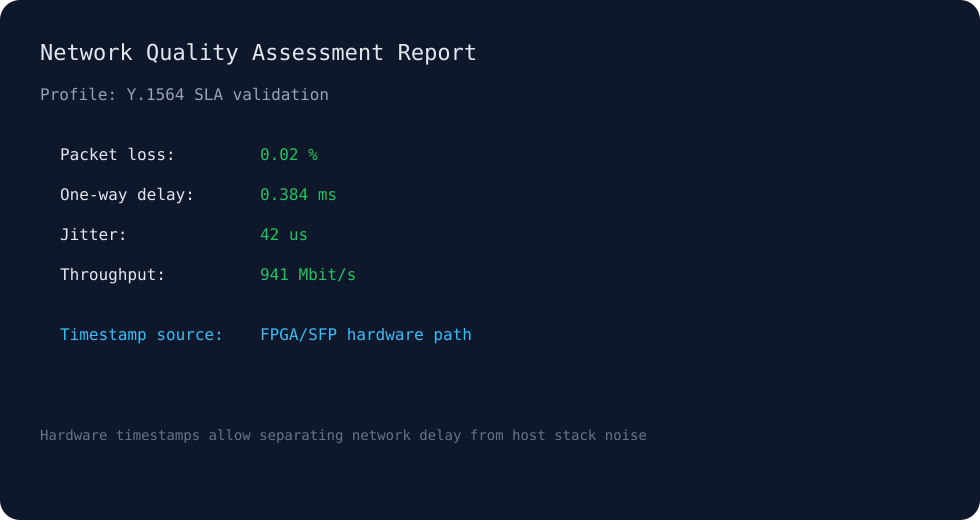

# network-quality-assessment

[](#)
[](#)
[](LICENSE)

## 🚀 Hardware timestamping vs software measurements

A **hardware-assisted network performance testing system** combining:
- custom IPv4 probe packets
- FPGA/SFP timestamping
- SLA-oriented metrics (RFC 2544 / ITU-T Y.1564)

---

## 🧭 Architecture


---

## 🔁 Packet flow


---

## 🌐 Test topology


---

## 📊 Example report



---

## ⚖️ Measurement approaches

| Approach | Accuracy | Where measured | Use case |
|----------|--------|---------------|----------|
| ping | low | OS | connectivity |
| software timestamps | medium | CPU | lab tests |
| FPGA/SFP timestamps | high | datapath | SLA / engineering |

---

## 💡 Why this is interesting

Unlike typical tools, this system:

- separates **network delay vs host delay**
- embeds measurement data directly into packets
- enables **engineering-grade SLA validation**

---

## 🔧 Build

```bash
make build
make test
```

---

## 📁 Docs

See `/docs` for full methodology and implementation details.

---

## 📜 License

MIT
