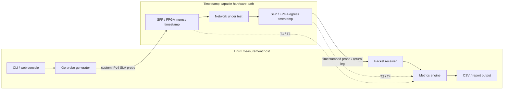
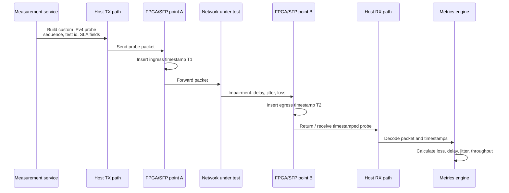

# network-quality-assessment

[](#)
[](#)
[](LICENSE)

A **hardware-assisted network performance testing system** for practical assessment of delay, jitter, packet loss, and throughput using a custom packet protocol, FPGA-based timestamping, and methodology-oriented test flows.

The repository is centered around real measurement tasks rather than synthetic benchmarks alone. It combines packet generation, custom probe packets, timestamp-aware processing, and structured validation approaches aligned with **RFC 2544** and **ITU-T Y.1564**.

## Why it is engineering-interesting

This project is not just a `ping` wrapper or a throughput script. It demonstrates a full measurement chain where software controls the test scenario, custom packets carry measurement metadata, and FPGA/SFP-side timestamps can be used to move timing closer to the physical network path.

In practice, that means the project can explain and prototype the difference between:

- host-level availability checks;
- software timestamp based measurements;
- hardware-assisted timestamping for SLA, delay, jitter, and acceptance testing.

## System architecture



## Packet flow



## Example report snapshot

```text
Network Quality Assessment Report
Test profile : SLA validation / Y.1564-oriented service check
Probe mode   : Custom IPv4 packets with timestamp fields
Duration     : 60 s
Packet rate  : 10 000 packets/s
Frame size   : 256 bytes

+----------------------+------------------+------------------+-------------+
| Metric               | Target           | Measured         | Status      |
+----------------------+------------------+------------------+-------------+
| Packet loss          | <= 0.10 %        | 0.02 %           | PASS        |
| Mean one-way delay   | <= 1.000 ms      | 0.384 ms         | PASS        |
| Peak-to-peak jitter  | <= 100 us        | 42 us            | PASS        |
| Throughput           | >= 900 Mbit/s    | 941 Mbit/s       | PASS        |
| Timestamp source     | FPGA/SFP path    | Hardware-assisted| OK          |
+----------------------+------------------+------------------+-------------+

Engineering value: the report separates traffic generation, packet metadata,
timestamp source, and SLA decision logic instead of treating the network as a
black box.
```

## Measurement approaches compared

| Approach | What it really measures | Timing point | Strengths | Limitations | Best use |
|---|---|---|---|---|---|
| `ping` / ICMP RTT | Host-to-host reachability and round-trip response time | OS network stack | Simple, universal, quick diagnostics | RTT only, OS scheduling noise, weak SLA detail, no packet-flow metadata | First-line connectivity check |
| Software timestamps | Application or kernel-level packet timing | Host CPU / OS path | Flexible, easy to integrate with Go services, good for prototypes and lab automation | Affected by scheduler, driver, buffering, interrupt moderation, and NIC queues | Functional testing, trend monitoring, repeatable lab workflows |
| FPGA/SFP timestamps | Packet timing close to the physical ingress/egress path | Hardware datapath near SFP / FPGA logic | Lower host-induced timing error, better separation of network delay from software overhead, suitable for SLA and acceptance workflows | Requires hardware support, timestamp discipline, calibration, and topology documentation | Engineering-grade delay, jitter, loss, and service-validation testing |

## Highlights

- **Go-based measurement service** and packet-processing pipeline
- **Custom IPv4 probe packet** with embedded SLA-oriented header
- **FPGA/SFP-based timestamp insertion** for hardware-assisted measurements
- **Loss, delay, one-way delay, jitter, and throughput** calculations
- **RFC 2544** style benchmarking support
- **ITU-T Y.1564** service validation support
- deployment scripts and web-console integration for practical use on Linux hosts

## Why this repository matters

Many network-testing repositories focus only on traffic generation or isolated metric collection. `network-quality-assessment` is more interesting because it sits at the boundary between **software measurement logic** and **hardware-assisted timing**.

That makes it useful for:

- network quality assessment projects
- SLA and service-validation tooling discussions
- test-system architecture work involving SFP or FPGA-assisted paths
- practical benchmarking and acceptance workflows for communication links

## Measurement model

At a high level, the system works as follows:

1. the server generates a custom IPv4 measurement packet;
2. the packet traverses the network under test and timestamp-capable SFP/FPGA points;
3. timestamps are inserted on the path and on the return leg;
4. the server receives the probe and derives the relevant metrics.

This model enables a more structured and reproducible view of link behavior than simple host-to-host pings or throughput-only tests.

## Project structure

### Core implementation

- Go measurement service and packet-processing logic
- custom packet format with embedded SLA header
- timestamp-aware metrics engine
- Linux-oriented deployment and runtime scripts
- web-console assets for operational use

### Main documentation

- [Overview](docs/overview.md)
- [Architecture](docs/architecture.md)
- [Packet Format](docs/packet-format.md)
- [Timestamp Model](docs/timestamp-model.md)
- [Metrics](docs/metrics.md)
- [Methodology](docs/methodology.md)
- [Test Modes](docs/test-modes.md)
- [Topology Detection](docs/topology-detection.md)
- [Acceptance Criteria](docs/acceptance-criteria.md)
- [Use Cases](docs/use-cases.md)
- [Results Example](docs/results-example.md)
- [Implementation Notes](docs/implementation-notes.md)
- [Implementation Map](docs/implementation-map.md)
- [Packet Route Diagram](docs/packet-route-diagram.md)
- [Setup Guide](docs/setup.md)

### Examples and sample results

- [RFC 2544 Example](examples/rfc2544/readme.md)
- [Y.1564 Example](examples/y1564/readme.md)
- [Sample Test 1 Summary](results/sample-test-1/summary.md)
- [Sample Metrics CSV](results/sample-test-1/metrics.csv)

## Local build and validation

From Linux or WSL:

```bash
make test
make test-cover
make build
make lint
```

Or run the full local validation pipeline:

```bash
make ci
```

The `Makefile` currently includes:

- `build`
- `test`
- `test-cover`
- `vet`
- `gofmt-check`
- `shell-lint`
- `php-lint`
- `web-link-check`
- `lint`
- `ci`

## Binary and runtime notes

The default build target produces:

```text
build/server-sfp-sla
```

The service reads database settings from environment variables, including:

- `SFP_SLA_DB_USER`
- `SFP_SLA_DB_PASSWORD`
- `SFP_SLA_DB_NAME`
- `SFP_SLA_DB_ADDR`
- `SFP_SLA_VERBOSE=1`

See [.env.example](.env.example) and [docs/setup.md](docs/setup.md) for deployment details.

## Deployment model

The Linux deployment flow is script-oriented and intended for practical installation on a host that uses raw sockets and system services.

Typical setup includes:

- dependency installation
- database initialization
- service deployment
- Apache/web-console publishing
- optional user creation for the web interface

## Status

Already documented and represented in the repository:

- metrics model
- methodology mapping
- packet format
- timestamp model
- test modes and topology behavior
- sample results and route diagrams
- setup and deployment guidance

A natural next step would be adding more real exported reports from production or field runs.

## Future improvements

Potential directions for strengthening the repository even further:

- add GitHub Actions for automated validation
- include richer real-world result sets from deployed systems
- expand benchmark and acceptance-report examples
- add deeper operational screenshots or dashboard artifacts
- document more hardware configurations and topology variants

## License

This project is licensed under the MIT License. See the [LICENSE](LICENSE) file for details.
