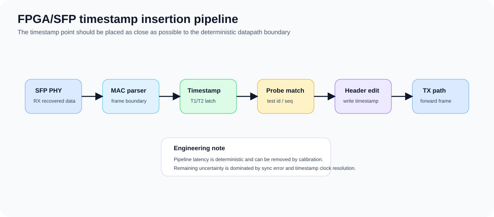
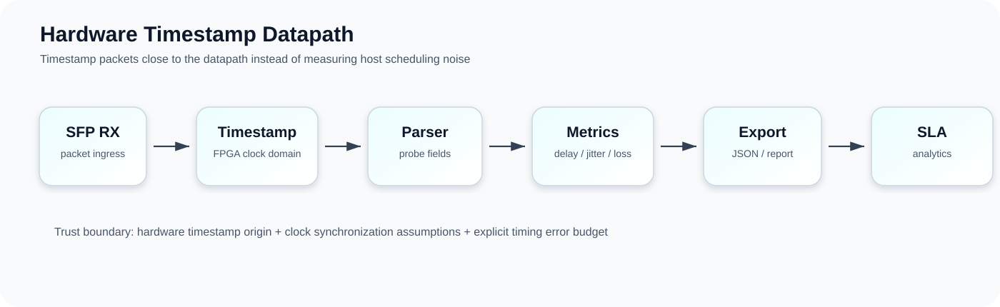
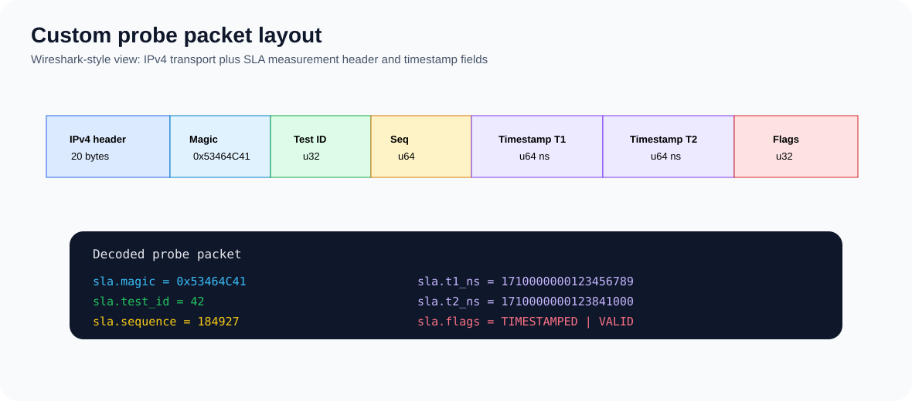
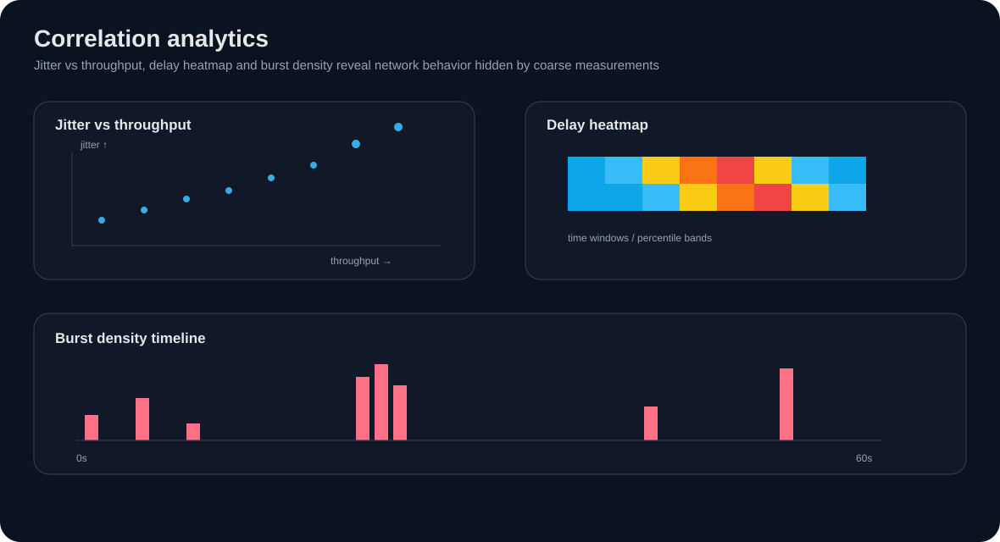
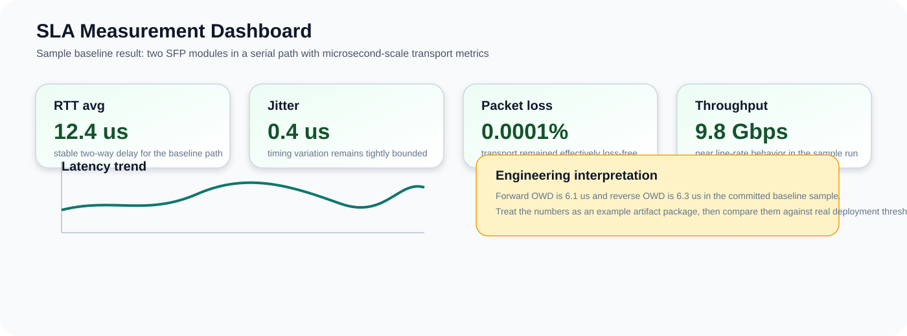

# network-quality-assessment

[](https://github.com/Lay007/network-quality-assessment/actions/workflows/docs-link-check.yml)
[](https://github.com/Lay007/network-quality-assessment/actions/workflows/synthetic-sla-demo.yml)

## 🚀 Hardware timestamping vs software measurement

**Problem**

Software-based measurements are affected by OS scheduling, buffering and interrupt latency.

**Solution**

Use FPGA/SFP datapath timestamping with custom SLA probe packets.

**Result**

- microsecond-level jitter visibility
- accurate one-way delay
- reliable SLA validation

---

## ⚡ What you get

- true network delay (not host delay)
- real jitter (not OS noise)
- packet loss on datapath
- correlation-ready metrics
- hardware-free synthetic SLA demo for reproducible review

---

## 🚀 Quick navigation

- [Runnable synthetic SLA demo](docs/synthetic-sla-demo.md)
- [Synthetic SLA demo plan](docs/synthetic-sla-demo-plan.md)
- [Architecture](#-architecture)
- [Packet flow](#-packet-flow)
- [Benchmark & analytics](#-benchmark--analytics)
- [Measurement credibility](docs/measurement-credibility.md)
- [Engineering metrics](docs/engineering-metrics.md)
- [SLA report template](reports/sla_report.template.md)
- [Experiment manifests](experiments/README.md)
- [Case study](#-case-study)
- [Network analysis](#-network-analysis)
- [Real-time system](#-real-time-system)
- [Root cause analysis](#-root-cause-analysis)
- [Clock synchronization](#-clock-synchronization)
- [Hardcore engineering](#-hardcore-engineering)
- [Quick start](#-quick-start)
- [Demo](#-demo)

---

## 🧪 Runnable synthetic SLA demo

Run the full reporting pipeline without FPGA/SFP hardware:

```bash
python tools/generate_synthetic_sla_trace.py \
  --output verification/reports/synthetic_sla_demo/synthetic_trace.csv

python tools/analyze_sla_trace.py \
  --input verification/reports/synthetic_sla_demo/synthetic_trace.csv \
  --output-dir verification/reports/synthetic_sla_demo
```

Generated artifacts:

```text
verification/reports/synthetic_sla_demo/
├─ synthetic_trace.csv
├─ sla_summary.csv
├─ report.md
├─ one_way_delay_timeseries.svg
├─ jitter_histogram.svg
└─ packet_loss_timeline.svg
```

The same flow is checked by GitHub Actions in `synthetic-sla-demo.yml`.

---

## 🧭 Architecture


---

## 🔁 Packet flow


---

## 🌐 Topology


---

## ⚙️ FPGA timestamp pipeline



### Hardware timestamp datapath



---

## 📦 Packet decode (Wireshark-style)



---

## 📊 Benchmark & analytics




### SLA dashboard



---

## 🧪 Case study

👉 [Metro Ethernet SLA validation](docs/case-study.md)

---

## 🌐 Network analysis

- 👉 [Network effects](docs/network-effects.md)
- 👉 [Traffic analysis](docs/traffic-analysis.md)
- 👉 [Anomaly detection](docs/anomaly-detection.md)

---

## 🧠 Root cause analysis

👉 [Root cause analysis rules](docs/root-cause-analysis.md)

---

## ⚡ Real-time system

👉 [Real-time pipeline](docs/realtime-pipeline.md)

---

## 📡 Monitoring integration

👉 [Monitoring integration](docs/integration-monitoring.md)

---

## ⏱️ Clock synchronization

👉 [PTP / clock sync](docs/ptp-clock-sync.md)

---

## 🧠 Hardcore engineering

- 👉 [Timing error budget](docs/timing-error-budget.md)
- 👉 [Latency model](docs/latency-model.md)
- 👉 [Measurement credibility](docs/measurement-credibility.md)
- 👉 [Engineering metrics](docs/engineering-metrics.md)
- 👉 [SLA report template](reports/sla_report.template.md)
- 👉 [Timestamp comparison manifest](experiments/software_vs_hardware_timestamp.yaml)

---

## 🔬 Quick start

Generate demo dataset and graphs:

```bash
python tools/generate_demo_benchmark.py
```

Run the synthetic SLA demo:

```bash
python tools/generate_synthetic_sla_trace.py --output verification/reports/synthetic_sla_demo/synthetic_trace.csv
python tools/analyze_sla_trace.py --input verification/reports/synthetic_sla_demo/synthetic_trace.csv --output-dir verification/reports/synthetic_sla_demo
```

---

## 🎯 Demo

👉 [Runnable synthetic SLA demo](docs/synthetic-sla-demo.md)
👉 [Run demo scenario](examples/demo/README.md)
👉 [View demo report](examples/demo/report.md)
👉 [Executive summary](examples/demo/executive-summary.md)
👉 [SLA demo manifest](experiments/sla_demo.yaml)
👉 [Software vs hardware timestamp manifest](experiments/software_vs_hardware_timestamp.yaml)

### Example output

```text
Packet loss: 0.02%   PASS
Delay:       0.384ms PASS
Jitter:      42us    PASS
Throughput:  941Mb/s PASS
```

### Flow

```text
probe -> timestamp -> metrics -> detection -> report
```

---

## 📜 License

MIT
