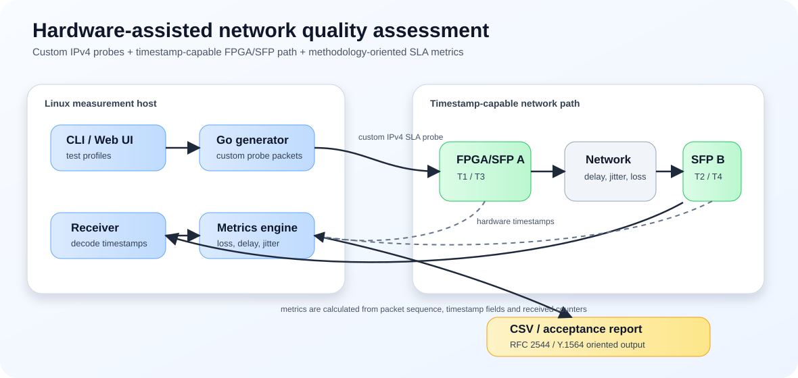
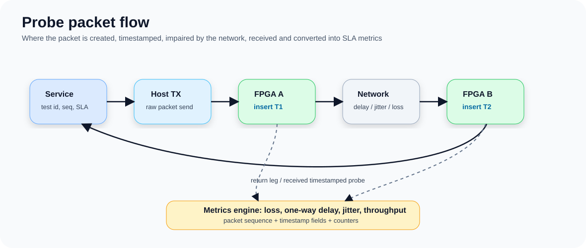
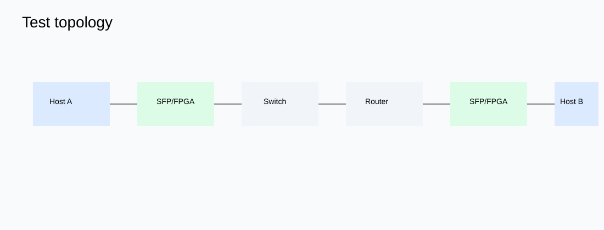
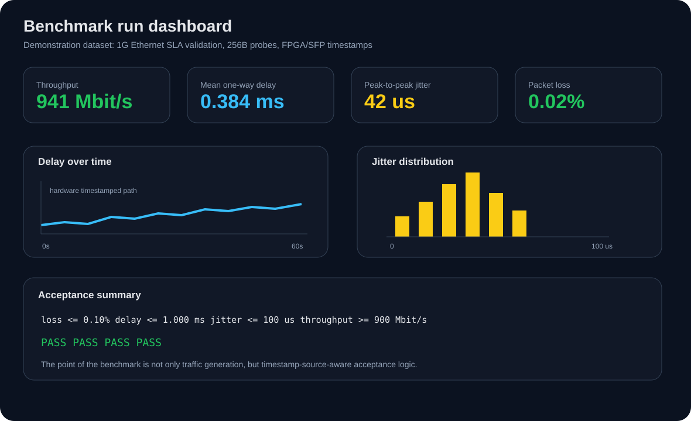
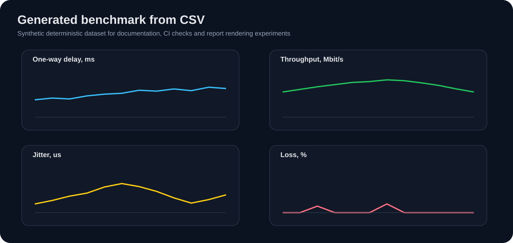

# network-quality-assessment

[](#)

## 🚀 Hardware timestamping vs software measurements

---

## 🧭 Architecture


## 🔁 Packet flow


## 🌐 Topology


## 📊 Benchmark (static)


## 📊 Benchmark (generated from CSV)


## 🧪 Case study
👉 docs/case-study.md

---

## 🧠 Hardcore engineering

### Timing error budget
👉 docs/timing-error-budget.md

### Latency model
👉 docs/latency-model.md

---

## 🔬 Generate your own benchmark

```bash
python tools/generate_demo_benchmark.py
```

Outputs:
- results/demo-benchmark/metrics.csv
- docs/assets/generated_benchmark.svg

---

## ⚖️ Measurement approaches

| Approach | Accuracy | Where measured |
|----------|--------|---------------|
| ping | low | OS |
| software | medium | CPU |
| FPGA/SFP | high | datapath |

---

## License
MIT
