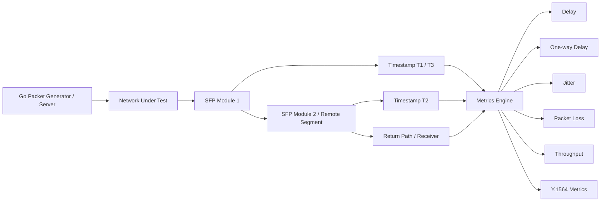

# Architecture

## High-Level Architecture

```mermaid
flowchart LR
    A[Go Packet Generator / Server] --> B[Network Under Test]
    B --> C[SFP Module 1]
    C --> D[SFP Module 2 / Remote Segment]
    D --> E[Return Path / Receiver]

    C --> F[Timestamp T1 / T3]
    D --> G[Timestamp T2]

    F --> H[Metrics Engine]
    G --> H
    E --> H

    H --> I[Delay]
    H --> J[One-way Delay]
    H --> K[Jitter]
    H --> L[Packet Loss]
    H --> M[Throughput]
    H --> N[Y.1564 Metrics]
```
