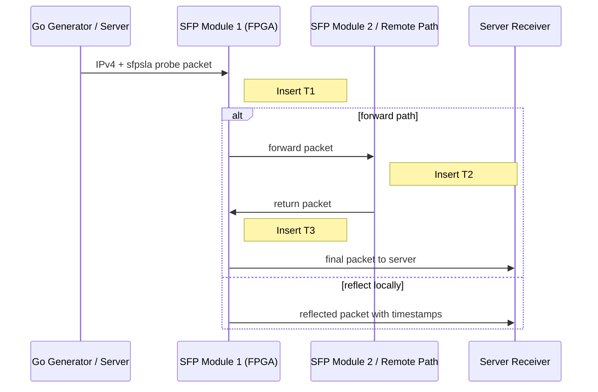

# Packet Route Diagram

## Measurement Route

## Interpretation

- T1: first module observation
- T2: remote/intermediate observation
- T3: return observation
- sequence number supports packet loss estimation
- sampled packets can be timestamped while broader traffic still supports loss statistics
